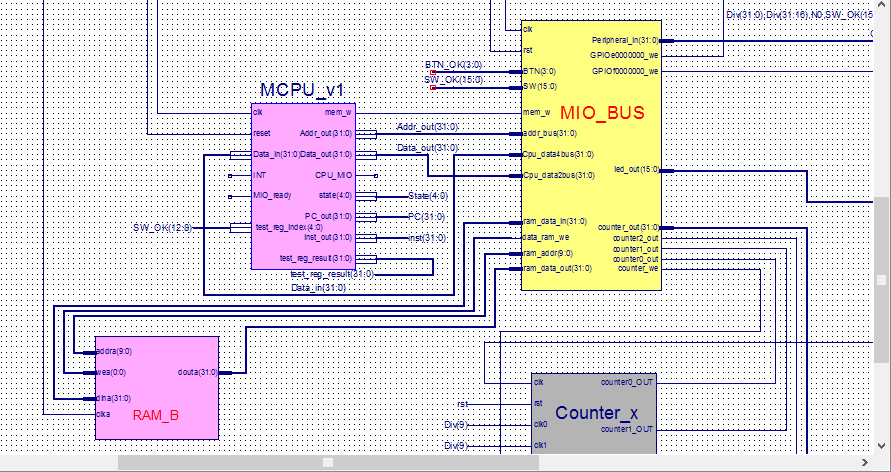

# 1. OVERVIEW
*MicroprogrammingProcessor*, as its name reveals, is a **hardware program** that 
simulate the behavior of a  trivial **single cycle CPU** with **micropramming controller**.
As a homework assigned in the **computer organization** course for sophomore majoring in CS,
it is an **individual project** for **non-comercial** purposes.  
# 2. TASK INTRODUCTION
1. Design the Datapath, bring together the basic units into Single-cycle clock CPU  
2. Implement at least 9instructions: Add, Sub, And, Or, Lw, Sw, Slt, Beq, J.  
3. Better implement the 16instructions: Add, Sub, And, Or, Addi, Ori, Sll, Srl, Lw, Sw, Slt, Beq, Bne, J, Jal, Jr  
4. Verify the CPU with program and observe the execution of program  
# 3. DESIGN PRINCIPLES
1. Datapath  
It’s still all the same as what in the multiple-cycle CPU:   
  
2. State figure    
It’s similar with that of the multiple-cycle CPU, except that some details are a little bit different. 
That’s we don’t have to maintain all things about each state since the dispatch logic curcuit and the control signals 
stored in the controller can help.  
  
Here are exactly what in the codes (Just a relative part of the controller):  
```
wire [2:0] AddrCtrl;
	// AddrCtrl == 000 for back to state 0
	// AddrCtrl == 001 for general decode
	// AddrCtrl == 010 for lw/sw decode
	// AddrCtrl == 011 for state++
	// AddrCtrl == 100 for R-type ALU completion
	// AddrCtrl == 101 for I-type ALU completion
									
	// seconde decoder
	reg [4:0] state;
	always @ (posedge clk or posedge rst) begin
		if(rst) state <= 5'd0;
		else case(AddrCtrl)
			3'd0: state <= 5'd0;
			3'd1: begin
				if(lw | sw) 
					state <= 5'd2;
				else if(addr | subr | andr | orr | xorr | norr | sltr)
					state <= 5'd6;
				else if(addi | slti)
					state <= 5'd10;
				else if(andi | ori | xori)
					state <= 5'd11;
				else if(branch)
					state <= 5'd8;
				else if(j)
					state <= 5'd9;
				else if(jal)
					state <= 5'd16;
				else if(shift)
					state <= 5'd13;
				else if(lui)
					state <= 5'd14;
				else if(jr)
					state <= 5'd15;
				else if(jalr)
					state <= 5'd17;
				end
			3'd2: begin
				if(lw)
					state <= 5'd3;
				else if(sw)
					state <= 5'd5;
				end
			3'd3: state <= state + 5'd1;
			3'd4: state <= 5'd7;
			3'd5: state <= 5'd12;
			default:;
		endcase
	end
```
3. Control signals for microprogramming 
It is also similar with that of the multiple-cycle CPU, except that they are not assigned in 
the combinational logic curcuit but the ROM. ( Here I use register in the verilog HDL exactly, 
since it behaves just like ROM and what’s more, it is convenient for debugging.
All the meanings are the same as those I have introduced in the report of multiple-cycle CPU, 
except that the last three bits, AddrCtrl[2:0], which I just mentioned in the previous part. Here is exactly the code:  
```
//22.PCWriteCond	21.PCWrite		20.MemWrite				
//19.IRWrite	  	18.RegWrite		17.PCsrc[1]		16.PCsrc[0]		15.RegDst[1]
//14.RegDst[0]    	13.MemToReg[1]		12.MemToReg[0]		11.ALUsrcA[1]		10.ALUsrcA[0]
//9.ALUsrcB[2]    	8.ALUsrcB[1]		7.ALUsrcB[0]		6.op[1]			5.op[0]
//4.IorD	      	3.ext			2.AddrCtrl[2]		1.AddrCtrl[1]		0.AddrCtrl[0]
	
	reg [22:0] ctrl[0:17];
	always @(posedge rst) begin
		// for	instruction fetch
		ctrl[0] <= 23'b01010000000000010100011; 
		// for	waiting state
		ctrl[1] <= 23'b00000000000000110101001; 
		// for	calculate memaddr
		ctrl[2] <= 23'b00000000000010100101010;	
		// for	read memory
		ctrl[3] <= 23'b00000000000000001110011;
		// for	write back
		ctrl[4] <= 23'b00001000001000001100000;
		// for	write memory
		ctrl[5] <= 23'b00100000000000001110000;
		// for	Rtype-ALU execution
		ctrl[6] <= 23'b00000000000010000000100;
		// for 	Rtype-ALU completion
		ctrl[7] <= 23'b00001000100000001100000;
		// for	branch execution
		ctrl[8] <= 23'b10000010000010001000000;
		// for jump execution
		ctrl[9]	<= 23'b01000100000000001100000;
		// for Itype-ALU_signedext execution
		ctrl[10] <= 23'b00000000000010100001101;
		// for Itype-ALU_zeroext execution
		ctrl[11] <= 23'b00000000000010100000101;
		// for Itype-ALU completion
		ctrl[12] <= 23'b00001000000000001100000;
		// for shift execution
		ctrl[13] <= 23'b00000000000101000000100;
		// for lui execution
		ctrl[14] <= 23'b00000000000111011100101;
		// for jump register execution
		ctrl[15] <= 23'b01000110000000001100000;
		// for jal completion
		ctrl[16] <= 23'b01001101010000001100000;
		// for jalr completion
		ctrl[17] <= 23'b01001110110000001100000;
	end
```
  
4. Interface for MCPU  
Nothing modified from the previous project on this part.  
  

# 4. TESTING RESULT
Everything went well in the following four tests:
## LED Banner
  
## Number traversal
  
## Timer
  
## Rectangle change
  

# 5. LICENSE
The content of all the codes are supposed to use a licence [AGPLv3](./LICENSE)  

# 6. HOW TO CONTRIBUTE
1. Learn what is a AGPLv3, if you have not yet done so (see details above).  
2.  Create your change to the repo in question.
- Fork the desired repo, develop and test your code changes.
- Ensure that your code is clear and comprehensible.
- Ensure that your code has an appropriate set of unit tests which all pass.
3. Submit a pull request.
4. The repo owner will review your request. If it is approved, the change will be merged. If it needs additional work, the repo owner will respond with useful comments.

# 7. CREDIT
First of all, I would like to extend my sincere gratitude to my supervisor, Xiaohong Jiang, for her instructive advice and useful suggestions on my learning on computer organization.   
I am also deeply grateful of Zhe Pan, the TA's help in the completion and assessment of this project.  
High tribute shall be paid to Licheng Guo, whose profound knowledge of CPU and Verilog HDL triggers my inspiration for this brilliant project. 
